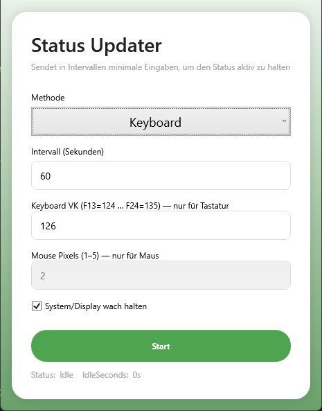

# StatusUpdater

StatusUpdater is a lightweight **WPF utility** that keeps your **Windows session active** by sending minimal, invisible input signals at configurable intervals.  
It prevents **Microsoft Teams** and other applications from switching you to **“Away”**, without interfering with your normal workflow.

---

## ✨ Features

- **Keeps status active** in Teams and similar apps.
- **Two methods**:
  - **Keyboard ping** (robust, using LeftShift ScanCode)
  - **Mouse nudge** (1–5 px)
- **Custom interval** with random jitter to avoid “robotic” patterns.
- **Optional system/display keep-awake** via `SetThreadExecutionState`.
- **Live idle monitor** showing current `IdleSeconds` for verification.
- **Clean MVVM WPF UI** with modern card design.

---

## 📸 Screenshot

  
*(Example UI with keyboard mode active.)*

---

## 🛠️ Installation

1. **Download the latest release** from the [Releases](../../releases) page.
2. Extract the ZIP and run **`StatusUpdater.exe`**.
3. *(Optional)* Add to **Windows Startup** if you want it to run automatically.

---

## 🚀 Usage

1. Launch **StatusUpdater**.
2. Choose your **method**:
   - **Keyboard** (recommended, F15 default)
   - **Mouse**
3. Set **interval** (60–90 seconds recommended).
4. Enable **“Keep system/display awake”** if needed.
5. Click **Start** – your status will remain **Available**.

💡 *IdleSeconds will reset to 0 whenever a ping is sent.*

---

## ⚠️ Notes

- **Does not work on a locked PC** – Windows and Teams will still show “Away” when the session is locked.
- Some **enterprise security policies** may block synthetic input; test IdleSeconds to verify.
- Recommended to run **as the same user session** where Teams is active.

---

## 🧩 Tech Stack

- **.NET 8.0 WPF**
- **MVVM pattern**
- **Win32 Interop** for `SendInput` and `SetThreadExecutionState`

---

## 📄 License

This project is licensed under the **MIT License** – see [LICENSE](LICENSE) for details.
